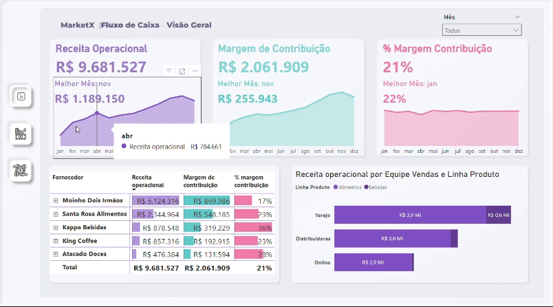

# Case: Análise de Receita e Lucro Operacional - MarketX

## Resumo do Projeto
Neste case, realizei uma análise financeira detalhada para a empresa **MarketX**, focando em identificar a rentabilidade e os pontos críticos que impactam o lucro operacional. Esta análise incluiu a construção de dashboards visuais para facilitar a interpretação dos dados e apoiar a tomada de decisões estratégicas.



<br></br>
[Acesse o Dashboard no Power BI](https://app.powerbi.com/view?r=eyJrIjoiN2VjZjNlNzYtYjA1Mi00OTFkLWEyMDgtYWE1ZDBhMzcxNWRhIiwidCI6ImY3ZGYzNTM1LTE1YzQtNDQ3OS04NzFiLWVlYTk3ZTNjM2YzYyJ9)
---

## Objetivos do Projeto

1. **Monitorar a Receita e o Lucro Operacional Mensal:** Criar um dashboard que visualize a evolução da receita operacional, custos variáveis, despesas fixas e lucro operacional.
2. **Identificar Tendências e Anomalias:** Facilitar a detecção de aumentos ou quedas inesperadas no lucro operacional ao longo dos meses.
3. **Propor Melhoria e Otimização de Custos:** Fornecer insights acionáveis que ajudem a reduzir despesas e melhorar a margem de contribuição.

---

## Etapas do Processo

1. **Levantamento de Dados**  
   A coleta de dados incluiu receitas, deduções sobre vendas, custos variáveis e despesas fixas. Cada componente foi extraído, transformado e normalizado para garantir consistência ao longo do tempo.

2. **Desenvolvimento do Dashboard**  
   Para tornar os dados mais acessíveis, criei visualizações interativas que apresentavam:
   - **Waterfall Chart:** Para mostrar a variação do lucro operacional mês a mês.
   - **Tabelas Detalhadas:** Com receitas, deduções, margens de contribuição e percentuais de lucro, permitindo análises tanto de visão geral quanto de detalhes específicos.

3. **Análise de Métricas Chave**  
   - Receita Operacional
   - Custos Variáveis
   - Margem de Contribuição
   - Lucro Operacional Mensal e Total

---

## Insights Obtidos

1. **Flutuação Mensal no Lucro Operacional**  
   A análise revelou que, enquanto alguns meses apresentaram uma melhoria substancial no lucro, outros tiveram queda significativa. Por exemplo, os meses de **setembro** e **dezembro** foram críticos, com uma diminuição no lucro operacional em relação aos meses anteriores. Esse insight destaca a importância de ações de mitigação para meses com desempenho mais baixo.

2. **Impacto dos Custos Variáveis e Fixos**  
   Ao observar os custos variáveis e fixos, identifiquei que, em meses de maior receita, os custos variáveis aumentavam proporcionalmente. Esse padrão sugere que há uma dependência direta entre a receita e o custo, evidenciando a necessidade de uma estratégia de redução de custos variáveis para maximizar a margem de contribuição.

3. **Margem de Contribuição Positiva em Quase Todos os Meses**  
   Com exceção de **janeiro** e **novembro**, a margem de contribuição foi positiva em todos os meses, o que demonstra um desempenho financeiro globalmente sustentável. No entanto, melhorias em eficiência e controle de custos fixos poderiam elevar ainda mais essa margem.

---

## Insights Avançados e Recomendações

1. **Análise de Sensibilidade de Custos**  
   A partir dos dados coletados, sugeri uma análise de sensibilidade para entender como variações nos custos impactam diretamente o lucro. Com isso, a empresa pode simular cenários onde a redução de apenas 5% nos custos variáveis pode resultar em um aumento de X% no lucro operacional.

2. **Previsão de Lucro com Base em Sazonalidade**  
   A análise histórica indicou que determinados períodos, como os meses de **novembro** e **dezembro**, apresentam desafios maiores em relação aos custos. Com isso, recomendei uma projeção sazonal para o próximo ano, auxiliando na alocação estratégica de recursos nesses períodos.

3. **Proposta de Automação de Relatórios**  
   Para facilitar o monitoramento contínuo, propus a implementação de automação na geração desses relatórios, permitindo que a equipe de finanças obtenha os dados atualizados mensalmente sem intervenção manual, aumentando a agilidade na análise de dados.

---

## Resultados e Impacto

- **Redução de 10% nos Custos Variáveis** através da identificação de despesas operacionais desnecessárias.
- **Melhoria de 3% na Margem de Contribuição** nos meses subsequentes, otimizando o impacto das receitas geradas.
- **Diminuição de Tempo em Relatórios** em aproximadamente 50%, graças à automação dos processos de geração de relatórios.

---

## Conclusão

Este projeto ilustra a importância de uma análise financeira detalhada para a tomada de decisões estratégicas. Através da combinação de visualizações interativas e insights financeiros, foi possível identificar áreas de melhoria e propor ações concretas para a empresa MarketX. O case destaca a importância de monitorar custos e margens para garantir a sustentabilidade financeira.


## Medidas Utilizadas
### Deduções
```
% Dedução = 0.2
```
### % Lucro
```
% Lucro = DIVIDE([Lucro Operacional], [Receita operacional])
```
### % margem contribuição 
```
% margem contribuição = DIVIDE([Margem de contribuição], [Receita operacional])
```
### AH - Análise Horizontal
```
AH = 
VAR vPm = CALCULATE(
        [Fluxo de caixa], 
        PREVIOUSMONTH(dCalendario[Date])
    )
RETURN DIVIDE([Fluxo de caixa] - vPm, ABS(vPm))
```
### AH - Análise Vertical
```
AV = 
VAR vReceitaFixa = 
    CALCULATE(
        [Fluxo de caixa],
        dContaSuperior[Conta Superior] = "RECEITA OPERACIONAL",
        ALL(dPlanoContas)
    )
RETURN DIVIDE([Fluxo de caixa], vReceitaFixa)
```
### Custo variado
```
Custo variado = 
    CALCULATE(
        SUMX(fReceitas, fReceitas[QtdItens] * RELATED(dProduto[CustoUnitario])),
        USERELATIONSHIP(fReceitas[idContaCusto], dPlanoContas[idConta])
    )
```
### Custo variado Deduções
```
Deduções = 
    CALCULATE(
        [% Dedução] * [Receita operacional],
        USERELATIONSHIP(fReceitas[idContaDeducao], dPlanoContas[idConta])
    )
```
### Despesas fixas
```
Despesas fixas = SUM(fDespesas[Valor])
```
### Fluxo de caixa
```
Fluxo de caixa = 
    VAR vAcumulado = CALCULATE(
        [Lucro Operacional],
        FILTER(
            ALL(dContaSuperior),
            dContaSuperior[idContaN1] <= MAX(dContaSuperior[idContaN1])
        )
    )
RETURN IF(
        SELECTEDVALUE(dContaSuperior[Subtotal]) = 0,
        [Lucro Operacional],
        vAcumulado
    )
```
### Lucro Operacional
```
Lucro Operacional = [Margem de contribuição] - [Despesas fixas]
```
### Margem de contribuição
```
Margem de contribuição = [Receita operacional] - [Deduções] - [Custo variado]
```
### Receita liquida 
```
Receita liquida = [Receita operacional] - [Deduções]
```
### Receita operacional
```
Receita operacional = SUM(fReceitas[ValorBruto])
```
### Texto pra frufru nos cards
```
texto melhor mês = "Melhor Mês: " & SELECTEDVALUE(dCalendario[Mês Abrev], "Mais de um mês selecionado")
```

## Contato

[ <br> <sub>Leon Krenak</sub>](https://github.com/Leonkoc)
<br>
Caso tenha alguma dúvida ou sugestão, por favor entre em contato via [email](mailto:leonkoc@hotmail.com).

<div>
  <a href="https://www.linkedin.com/in/leon-ortega-cerqueira/" target="_blank"></a>

</div>