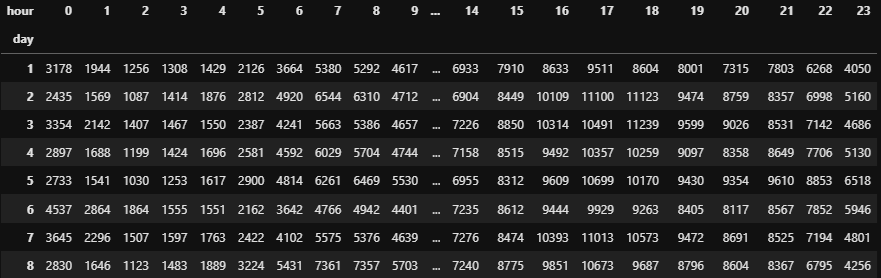

# Análise de Dados de Corridas da Uber em Nova York
Este documento apresenta uma análise detalhada dos dados de corridas da Uber em Nova York. O objetivo é identificar padrões de demanda, explorar a relação entre diferentes variáveis e fornecer insights para otimizar as operações da empresa. Através da limpeza, exploração e visualização dos dados, foram obtidos resultados valiosos que podem auxiliar na tomada de decisões estratégicas. Além disso, essa análise pode ser um recurso útil para concorrentes ou empresas que desejam ingressar no ramo, oferecendo informações essenciais para entender o mercado e desenvolver estratégias competitivas.
# Fonte de dados
Os dados foram retirados do [Kaggle](https://www.kaggle.com/datasets/fivethirtyeight/uber-pickups-in-new-york-city/data).

## 1. Importação das Bibliotecas

As bibliotecas `pandas`, `numpy`, `seaborn`, `matplotlib.pyplot` são essenciais para manipulação de dados, análise e visualização. Estas bibliotecas permitem processar grandes volumes de dados e criar gráficos informativos que ajudam a identificar tendências.

```python
import pandas as pd
import numpy as np
import seaborn as sns
import matplotlib.pyplot as plt
import os
```
* pandas: Manipulação e análise de dados.
* numpy: Operações matemáticas e lógicas de forma vetorizada.
* seaborn: Visualização de dados.
* matplotlib.pyplot: Criação de gráficos e figuras.

## 2. Listagem de Arquivos do Dataset
Usamos a função os.listdir() para listar os arquivos contidos no diretório que possui os dados. Esses arquivos contêm informações de diferentes fornecedores de serviços de transporte e múltiplos períodos de tempo.
```python
os.listdir(r"C:\Users\*****\OneDrive\Documentos\Case_py\Uber\Datasets")
```
### Resultado:

```python
[
 ['other-American_B01362.csv',
 'other-Carmel_B00256.csv',
 'other-Dial7_B00887.csv',
 'other-Diplo_B01196.csv',
 'other-Federal_02216.csv',
 'other-FHV-services_jan-aug-2015.csv',
 'other-Firstclass_B01536.csv',
 'other-Highclass_B01717.csv',
 'other-Lyft_B02510.csv',
 'other-Prestige_B01338.csv',
 'other-Skyline_B00111.csv',
 'Uber-Jan-Feb-FOIL.csv',
 'uber-raw-data-apr14.csv',
 'uber-raw-data-aug14.csv',
 'uber-raw-data-janjune-15.csv',
 'uber-raw-data-janjune-15_sample.csv',
 'uber-raw-data-jul14.csv',
 'uber-raw-data-jun14.csv',
 'uber-raw-data-may14.csv',
 'uber-raw-data-sep14.csv']
]
```
## 3. Carregamento do Dataset
Para análise inicial, carregamos o arquivo uber-raw-data-janjune-15_sample.csv, que é um subconjunto das corridas realizadas no primeiro semestre de 2015. Após o carregamento, o dataset é exibido e suas dimensões verificadas.
```python
uber_15 = pd.read_csv(r"C:\Users\******\OneDrive\Documentos\Case_py\Uber\Datasets\uber-raw-data-janjune-15_sample.csv")
print(uber_15.shape)  # Resultado esperado: (100000, 4)
print(uber_15.head())

```
### Resultado:
* Dimensões: 100.000 linhas e 4 colunas.
### Colunas:
- Dispatching_base_num: Identificação da base de envio.
- Pickup_date: Data e hora do embarque.
- Affiliated_base_num: Identificação da base afiliada.
- locationID: Identificação da localização.

## 4. Verificação e Remoção de Duplicatas
Para garantir a integridade dos dados, verificamos a presença de linhas duplicadas e as removemos
```python
uber_15.duplicated().sum()  # Resultado: 54
uber_15.drop_duplicates(inplace=True)
```
Após a remoção de duplicatas, a contagem é revalidada para confirmar que não restam valores duplicados.
```python
uber_15.duplicated().sum()  # Resultado: 0
uber_15.shape  # Novo resultado: (99946, 4)
```
* Resumo: 54 linhas duplicadas foram identificadas e removidas, deixando o dataset com 99.946 linhas.

## 5. Verificação dos Tipos de Dados e Valores Faltantes
```python
print(uber_15.dtypes)
print(uber_15.isnull().sum())
```
### Resultado:
Tipos de Dados:
- Dispatching_base_num: object
- Pickup_date: object
- Affiliated_base_num: object
- locationID: int64
- Valores Nulos: Nenhum valor nulo foi encontrado.

## 6. Verificação de Valores Nulos

Foi realizada uma verificação de valores nulos em cada coluna do dataset. O resultado identificou 1.116 valores ausentes na coluna `Affiliated_base_num`, enquanto as demais colunas não apresentaram valores nulos.

```python
uber_15.isnull().sum()
```
### Resultado:
```python
Dispatching_base_num       0
Pickup_date                0
Affiliated_base_num     1116
locationID                 0
```
Para a análise, decidimos deixar os valores ausentes na coluna Affiliated_base_num conforme a análise preliminar.

## 7. Conversão do Tipo de Dados da Coluna Pickup_date
A coluna Pickup_date foi originalmente carregada como uma string (object), mas, por representar uma data e hora, convertemos essa coluna para o tipo datetime. Essa transformação facilita análises temporais, como identificar padrões de viagens por dia da semana ou hora do dia.
```python
type(uber_15["Pickup_date"][0])  # Resultado: str

uber_15['Pickup_date'] = pd.to_datetime(uber_15['Pickup_date'])

uber_15['Pickup_date'].dtype  # Resultado: datetime64[ns]

```
Após a conversão, confirmamos que Pickup_date está agora no tipo datetime64[ns], permitindo manipulações e filtragens temporais eficientes.

## 8. Verificação Final dos Tipos de Dados
Após a conversão da coluna Pickup_date, os tipos de dados das colunas foram verificados para garantir consistência no dataset.
```python
uber_15.dtypes
```
### Resultado Final dos Tipos de Dados:

- Dispatching_base_num: object
- Pickup_date: datetime64[ns]
- Affiliated_base_num: object
- locationID: int64

## 9. Criação da Coluna `month`

Para facilitar a análise dos dados por mês, criamos uma nova coluna chamada `month`, extraída da coluna `Pickup_date`. Utilizamos o método `.dt.month_name()` para transformar os dados temporais em nomes completos dos meses.

```python
# Extraindo o nome dos meses da coluna Pickup_date
uber_15['month'] = uber_15['Pickup_date'].dt.month_name()
```
A nova coluna contém o nome completo dos meses, como "January", "February", "March", etc., e foi adicionada ao dataset conforme mostrado abaixo:

| Dispatching_base_num | Pickup_date          | Affiliated_base_num | locationID | month   |
|----------------------|----------------------|---------------------|------------|---------|
| B02617               | 2015-05-02 21:43:00  | B02764              | 237        | May     |
| B02682               | 2015-01-20 19:52:59  | B02682              | 231        | January |
| B02617               | 2015-03-19 20:26:00  | B02617              | 161        | March   |
| B02764               | 2015-04-10 17:38:00  | B02764              | 107        | April   |
| B02764               | 2015-03-23 07:03:00  | B00111              | 140        | March   |

## 10. Análise por Mês
Para entender a distribuição das corridas ao longo dos meses, realizamos a contagem de viagens por mês usando o método .value_counts() e visualizamos os resultados em um gráfico de barras.
```python
uber_15['month'].value_counts()

# por padrão retorna um gráfico de linhas, fiz a escolha de barras para esse caso
uber_15['month'].value_counts().plot(kind='bar')
```


### Gráfico de Barras
O gráfico de barras mostra a quantidade de viagens distribuídas por mês. O mês de junho apresenta o maior número de corridas, seguido por maio. Os meses de janeiro e fevereiro têm a menor quantidade de viagens.
Observações:

- Junho teve o maior número de viagens registradas, seguido por maio.
- Janeiro e fevereiro apresentaram os menores volumes de viagens.

## 11. Extração de Componentes da Data
Para facilitar a análise temporal, extraímos informações adicionais da coluna Pickup_date, incluindo o dia, a hora e o nome do dia da semana. Isso permite um entendimento mais granular das corridas.
```python
# Extraindo o dia, o nome do dia da semana e a hora da coluna Pickup_date
uber_15['weekday'] = uber_15['Pickup_date'].dt.day_name()
uber_15['day'] = uber_15['Pickup_date'].dt.day
uber_15['hour'] = uber_15['Pickup_date'].dt.hour
uber_15['minute'] = uber_15['Pickup_date'].dt.minute

uber_15.head(3)
```
| Dispatching_base_num | Pickup_date         | Affiliated_base_num | locationID | month   | weekday  | day | hour | minute |
|----------------------|---------------------|----------------------|------------|---------|----------|-----|------|--------|
| B02617               | 2015-05-02 21:43:00 | B02764               | 237        | May     | Saturday | 2   | 21   | 43     |
| B02682               | 2015-01-20 19:52:59 | B02682               | 231        | January  | Tuesday  | 20  | 19   | 52     |
| B02617               | 2015-03-19 20:26:00 | B02617               | 161        | March   | Thursday | 19  | 20   | 26     |

## 12. Tabela de Contingência
Utilizamos a função pd.crosstab() para criar uma tabela de contingência que relaciona os meses com os dias da semana. Isso ajuda a visualizar a distribuição das corridas em diferentes dias ao longo dos meses.
```python
pivot = pd.crosstab(index=uber_15['month'], columns=uber_15['weekday'])
pivot
```
| weekday  | Friday | Monday | Saturday | Sunday | Thursday | Tuesday | Wednesday |
|----------|--------|--------|----------|--------|----------|---------|-----------|
| April    | 2365   | 1833   | 2508     | 2052   | 2823     | 1880    | 2521      |
| February | 2655   | 1970   | 2550     | 2183   | 2396     | 2129    | 2013      |
| January  | 2508   | 1353   | 2745     | 1651   | 2378     | 1444    | 1740      |
| June     | 2793   | 2848   | 3037     | 2485   | 2767     | 3187    | 2503      |
| March    | 2465   | 2115   | 2522     | 2379   | 2093     | 2388    | 2007      |
| May      | 3262   | 1865   | 3519     | 2944   | 2627     | 2115    | 2328      |

### 12.a Análise de Corridas: Crosstab
Nesta seção, utilizamos a função pd.crosstab do Pandas para analisar a relação entre os meses e os dias da semana nas corridas do Uber. Essa análise é fundamental para entender como a demanda varia ao longo do tempo, permitindo a identificação de padrões que podem informar estratégias de marketing e operação.

### Interpretação dos Resultados
A tabela resultante apresenta a contagem de corridas realizadas em cada combinação de mês e dia da semana, permitindo observar:

* Picos de Atividade: É possível identificar quais meses e dias da semana têm maior demanda. Por exemplo, se notamos um número significativamente maior de corridas em uma combinação específica (como "May" e "Saturday"), isso pode indicar um aumento na demanda durante esses períodos.

* Tendências Sazonais: A análise pode revelar tendências sazonais. Se, por exemplo, os meses de junho e julho apresentarem consistentemente números mais altos de corridas durante os finais de semana, isso pode sugerir que esses meses são períodos de maior atividade.

* Planejamento Estratégico: Com base nessa análise, as equipes de marketing e operações podem planejar promoções ou aumentar a disponibilidade de motoristas em dias e meses com alta demanda.

### 12.b Plotando a Crosstab
```python
pivot.plot(kind = 'bar')
#aqui me retornou uma gráfico mas com a legenda sobre o gráfico, tive que fazer alguns ajustes
race_per_month = pivot.plot(kind = 'bar', figsize= (8,6))
race_per_month.legend(loc = 'upper left', bbox_to_anchor = (1,1))
```


#### Análise de Volume de Atividades por Dia da Semana e Mês
Este gráfico de barras mostra a distribuição das atividades ao longo dos meses, separadas por dia da semana. Cada barra representa o volume de atividades em um mês específico, com cores que indicam os diferentes dias da semana (por exemplo, sexta-feira, segunda-feira, etc.). Essa visualização permite identificar tendências mensais e semanais no volume de atividades, facilitando a comparação entre os dias.

Interpretação
Padrões Semanais: É possível observar que certos dias da semana têm consistentemente volumes maiores ou menores em comparação com outros dias, permitindo insights sobre os dias mais movimentados.
Variações Mensais: Com a separação por meses, é possível identificar se há sazonalidades ou mudanças de comportamento de um mês para outro.

### 13. Análise de Corridas por Dia da Semana e Hora
Nesta etapa, foi realizada uma agregação dos dados de corridas, agrupando-os por dia da semana e hora. O objetivo é identificar a quantidade de corridas realizadas em diferentes horários de cada dia, o que pode revelar padrões de comportamento de usuários ao longo da semana e em horários específicos.

```python
uber_15.groupby(['weekday', 'hour']).size()
race_per_hour = uber_15.groupby(['weekday', 'hour'], as_index = False).size()
race_per_hour
```

Saída
A saída gerada contém três colunas:
| weekday    | hour | size |
|------------|------|------|
| Friday     | 0    | 581  |
| Friday     | 1    | 333  |
| Friday     | 2    | 197  |
| Friday     | 3    | 138  |
| Friday     | 4    | 161  |
| ...        | ...  | ...  |
| Wednesday  | 19   | 1044 |
| Wednesday  | 20   | 897  |
| Wednesday  | 21   | 949  |
| Wednesday  | 22   | 900  |
| Wednesday  | 23   | 669  |


* weekday: Dia da semana (por exemplo, sexta-feira, segunda-feira, etc.).
* hour: Hora do dia, de 0 a 23.
* size: Quantidade de corridas realizadas para cada combinação de dia da semana e hora.

## 14. Análise de Corridas por Hora e Dia da Semana

Para visualizar a distribuição das corridas ao longo do dia, foi criada uma visualização com seaborn.pointplot, representando a quantidade de corridas (size) ao longo das horas (hour) para cada dia da semana (weekday). Esse gráfico permite observar como o volume de corridas varia em diferentes horas e em dias específicos.

```Python
race_per_hour_plot = plt.figure(figsize = (8,6))
race_per_hour_plot = sns.pointplot(x = 'hour', y = 'size', hue = 'weekday', data = race_per_hour)
race_per_hour_plot.legend(loc = 'upper left', bbox_to_anchor = (1,1))
race_per_hour_plot
```


- É possível observar que o volume de corridas diminui durante a madrugada e aumenta ao longo do dia, com picos distintos dependendo do dia da semana.
- Sexta-feira e sábado, por exemplo, apresentam volumes de corridas mais elevados durante a noite, sugerindo uma maior demanda nesses horários.
Este gráfico é útil para identificar os períodos de maior e menor movimento, auxiliando na alocação de recursos de acordo com a demanda por dia e hora.


## 15. Análise de Corridas por Hora e Dia da Semana
Importação das bibliotecas necessárias para visualização de dados com Plotly e interação em notebooks

import chart_studio.plotly as py
import plotly.graph_objs as go
import plotly.express as px
from plotly.offline import download_plotlyjs, init_notebook_mode, plot, iplot

* Inicializa o modo offline do Plotly para exibir gráficos diretamente no notebook
init_notebook_mode(connected=True)

* Leitura do arquivo CSV contendo dados de veículos ativos e número de viagens
* O arquivo é carregado no DataFrame 'uber_vehicles'
uber_vehicles = pd.read_csv(r"C:\Users\*****\OneDrive\Documentos\Case_py\Uber\Datasets\Uber-Jan-Feb-FOIL.csv")

* Exibição das primeiras linhas do DataFrame para entender sua estrutura e dados
uber_vehicles.head(2)

* Criação de um gráfico de caixa (boxplot) com Plotly Express para analisar a
 distribuição de veículos ativos ('active_vehicles') por base de despacho 

```python
('dispatching_base_number').
px.box(
    x='dispatching_base_number',    # Eixo x: número da base de despacho
    y='active_vehicles',            # Eixo y: número de veículos ativos
    data_frame=uber_vehicles        # DataFrame com os dados a serem visualizados
)
```


### Código

```python
    px.box(x='dispatching_base_number', y='active_vehicles', data_frame=uber_vehicles)
```
* A função box é usada para criar um gráfico de box plot, que é uma forma visual boa de resumir uma distribuição de dados.


## 15.a Interpretação do Gráfico geral
### O que o gráfico mostra:

O gráfico de box plot gerado por esse código visualiza a distribuição do número de veículos ativos em diferentes bases de despacho. Cada caixa representa uma base de despacho, e a posição das caixas ao longo do eixo x corresponde ao valor da variável 'dispatching_base_number'.

### Elementos do box plot:

* Caixa: Representa o intervalo interquartil (IQR), que contém 50% dos dados.
* Linha dentro da caixa: Indica a mediana dos dados.
* Bigodes: Estendem-se a partir da caixa e representam o intervalo dos dados, excluindo outliers.
* Pontos: Representam os outliers, ou seja, valores que estão muito distantes da maioria dos dados.

### O que podemos inferir:

* Variabilidade: A altura das caixas e a extensão dos bigodes indicam a variabilidade do número de veículos ativos entre as diferentes bases de despacho. Bases com caixas mais altas e bigodes mais longos apresentam maior variabilidade no número de veículos.

* Outliers: A presença de outliers sugere que algumas bases de despacho podem ter um número significativamente maior ou menor de veículos ativos em comparação com as outras.

* Tendências: Ao comparar as posições das caixas e das medianas, podemos identificar possíveis tendências no número de veículos ativos entre as diferentes bases de despacho. Por exemplo, se as caixas estiverem ordenadas de forma crescente ou decrescente, isso indica uma tendência geral no número de veículos.


## Detalhando as caixas com JS


# Análise do Box Plot para a Base B02764 


* Máximo (4395): Representa o maior valor observado na base de dados para a base B02764. Indica que em algum momento, houve 4395 veículos ativos nessa base.
* Cerca Superior (4395): Coincide com o valor máximo neste caso. A cerca superior delimita o intervalo de dados considerados como "normais". Valores acima dela são considerados outliers.
* Terceiro Quartil (Q3: 3957.25): 75% dos dados da base B02764 são menores ou iguais a esse valor. Isso significa que em 75% do tempo, havia no máximo 3957 veículos ativos.
* Mediana (3734): O valor central dos dados. Metade dos dados é menor e metade é maior que 3734.
* Primeiro Quartil (Q1: 3483.25): 25% dos dados da base B02764 são menores ou iguais a esse valor. Ou seja, em 25% do tempo, havia no máximo 3483 veículos ativos.
* Cerca Inferior (2862): Valores abaixo dessa cerca são considerados outliers.
* Mínimo (1619): Representa o menor valor observado na base de dados para a base B02764. Indica que em algum momento, houve apenas 1619 veículos ativos nessa base.

O box plot da base B02764 revela uma distribuição relativamente ampla dos dados, com um leve viés para valores mais altos. A mediana (3734) indica que, em média, havia cerca de 3734 veículos ativos nessa base. No entanto, a presença de um outlier inferior (1619) sugere que houve períodos em que o número de veículos ativos foi significativamente menor.

### O que isso significa?

* Variabilidade: O tamanho da caixa, que representa o intervalo interquartil (IQR), indica uma variação considerável no número de veículos ativos ao longo do tempo.
* Assimetria: A mediana está ligeiramente mais próxima do terceiro quartil do que do primeiro quartil, sugerindo uma leve assimetria positiva na distribuição. Isso significa que a cauda da distribuição se estende mais para valores altos do que para valores baixos.
* Outliers: A presença do outlier inferior indica a ocorrência de eventos incomuns, como uma redução drástica na demanda ou problemas operacionais, que levaram a uma diminuição significativa no número de veículos ativos.

### Conclusões e Próximos Passos
Com base nesse gráfico, podemos inferir que a base B02764 experimenta variações consideráveis no número de veículos ativos ao longo do tempo. A presença de um outlier inferior merece uma investigação mais aprofundada para entender as causas dessa redução e avaliar seu impacto nas operações. Nesse apanhado não é aprofundar nesses detalhes, mas em um caso real recomendaria avaliar esses pontos.


## Recomendação de leitura
Se você não conhece a anatomia do boxplot, recomendo a leitura deste texto do [ DataCamp](https://www.datacamp.com/pt/tutorial/python-boxplots).


# 16. Criação do Heatmap
Após o pré-processamento dos dados e a remoção de duplicatas, começamos a explorar a densidade geográfica das viagens. Para isso, criamos um heatmap que destaca as áreas com maior concentração de corridas.

## 16.a Seleção dos Arquivos
Primeiro, carregamos os arquivos referentes aos meses de abril, maio, junho, julho, agosto e setembro de 2014. Optamos por excluir os arquivos uber-raw-data-janjune-15.csv e uber-raw-data-janjune-15_sample.csv para focar em um período mais específico.

```Python
files = os.listdir(r"C:\Users\*****\OneDrive\Documentos\Case_py\Uber\Datasets")[-8:]
files.remove('uber-raw-data-janjune-15.csv')
files.remove('uber-raw-data-janjune-15_sample.csv')
```
## 16.b Concatenando os Dados
Utilizamos o pd.concat para combinar os arquivos selecionados em um único DataFrame, resultando em aproximadamente 4,5 milhões de registros. Em seguida, removemos 82.581 registros duplicados, o que deixou o DataFrame final com 4.451.746 linhas e 4 colunas (Date/Time, Lat, Lon, Base).

```python
final_df = pd.DataFrame()
path = r"C:\Users\bruna\OneDrive\Documentos\Case_py\Uber\Datasets"
for file in files :
   current_df = pd.read_csv(path+'/'+file)
   final_df = pd.concat([current_df , final_df])
```

## 16.c Preparação para o Heatmap
Para gerar o heatmap, agrupamos os dados pelas coordenadas de latitude (Lat) e longitude (Lon), calculando a frequência de corridas para cada ponto geográfico.

```python
rush_uber = final_df.groupby(['Lat', 'Lon'] , as_index=False).size()
```
## 16.d Criação do Heatmap
Utilizando a biblioteca folium e seu plugin HeatMap, criamos um mapa base e adicionamos a camada de calor com base nas localizações de maior concentração de corridas. O heatmap é então visualizado, destacando as áreas de maior atividade.

```python
import folium
from folium.plugins import HeatMap

base_map = folium.Map()
HeatMap(rush_uber).add_to(base_map)
```

Esse heatmap fornece uma visão intuitiva das regiões mais movimentadas, o que pode auxiliar em decisões estratégicas de posicionamento de veículos e planejamento logístico.

### Pontos relevantes
Com base na imagem fornecida, podemos inferir algumas características preliminares do heatmap de viagens de Uber

* Alta concentração em áreas urbanas: A intensa coloração nas áreas mais centrais indica uma demanda elevada por viagens de Uber nessas regiões, o que é típico de centros urbanos com alta densidade populacional.

* Corredores de transporte: As linhas e faixas de calor mais intensas sugerem a existência de corredores de transporte importantes, como rodovias, avenidas principais ou vias de acesso a centros comerciais ou de negócios.

* Pontos de interesse: Áreas com picos de calor podem indicar a presença de pontos de interesse, como aeroportos, estações de trem, centros de convenções ou locais de grande concentração de bares e restaurantes.

* Padrões de deslocamento: A forma geral do heatmap pode revelar padrões de deslocamento, como movimentos pendulares (casa-trabalho) ou concentrações em áreas de lazer.

# 17 Exploração de Dados e Criação de Recursos (Features)
Este ponto exploramos a estrutura do DataFrame final_df e cria novos recursos para facilitar análises posteriores.

## 17.a Examinando a Estrutura do DataFrame
Começamos examinando as colunas do DataFrame e as primeiras linhas usando o seguinte código:
```python
print(final_df.columns)
print(final_df.head(3))
```
| Date/Time           | Lat     | Lon     | Base   |
|---------------------|---------|---------|--------|
| 2014-09-01 00:01:00 | 40.2201 | -74.0021 | B02512 |
| 2014-09-01 00:01:00 | 40.7500 | -74.0027 | B02512 |
| 2014-09-01 00:03:00 | 40.7559 | -73.9864 | B02512 |

Documentação do Ponto 17: Exploração de Dados e Criação de Recursos (Features)
Este ponto explora a estrutura do DataFrame final_df e cria novos recursos para facilitar análises posteriores.

### 17.b Examinando a Estrutura do DataFrame
Começamos examinando as colunas do DataFrame e as primeiras linhas usando o seguinte código:

```Python
print(final_df.columns)
print(final_df.head(3))
Use o código com cuidado.
```
A saída:

| Date/Time           | Lat     | Lon     | Base   |
|---------------------|---------|---------|--------|
| 2014-09-01 00:01:00 | 40.2201 | -74.0021 | B02512 |
| 2014-09-01 00:01:00 | 40.7500 | -74.0027 | B02512 |
| 2014-09-01 00:03:00 | 40.7559 | -73.9864 | B02512 |


#### A saída revela quatro colunas:

* Date/Time: Esta coluna contém a data e hora de cada coleta em formato string.
* Lat: Esta coluna representa a latitude da localização da coleta.
* Lon: Esta coluna representa a longitude da localização da coleta.
* Base: Esta coluna pode conter informações sobre a base de coleta (possivelmente necessitando de investigação posterior).

## 17.c Tratando o Formato de Data e Hora
Observamos que a coluna Date/Time não está em um formato adequado para análises baseadas no tempo. Para resolver isso, a convertemos para um formato de data e hora usando a função pd.to_datetime:

```python
final_df['Date/Time'] = pd.to_datetime(final_df['Date/Time'], format='%m/%d/%Y %H:%M:%S')
```
Aqui, especificamos a string de formato '%m/%d/%Y %H:%M:%S' para garantir a análise correta dos componentes de data e hora.

## 17.d Identificando Registros Duplicados de Data e Hora

Observamos que há entradas múltiplas com o mesmo valor de índice (zero) após converter a coluna Date/Time. Isso pode ser devido à concatenação ou junção de vários conjuntos de dados que continham registros de data e hora duplicados.

## 17.e Extraindo Recursos de Dia e Hora
Para facilitar a análise baseada na hora do dia e no dia da semana, extraímos novos recursos da coluna Date/Time usando o acessador dt:

```Python
final_df['day'] = final_df['Date/Time'].dt.day
final_df['hour'] = final_df['Date/Time'].dt.hour
```
Este código cria duas novas colunas:

* day: Esta coluna representa o dia do mês (1 a 31).
* hour: Esta coluna representa a hora do dia (0 a 23).

Agora podemos explorar a distribuição de coletas em diferentes dias e horas. Aqui, calculamos o número de coletas para cada combinação de dia e hora usando os métodos groupby e size:

```python
day_hour_counts = final_df.groupby(['day', 'hour']).size()
print(day_hour_counts)
```
Este código exibe um DataFrame mostrando a contagem de coletas para cada combinação de dia e hora.

## Observação 
Anteriormente trabalhamos com pivot usando groupby agora vamos usar a unstack

```python
pivot_day_hour = final_df.groupby(['day', 'hour']).size().unstack()
pivot_day_hour
```
A função unstack() em Python, especificamente na biblioteca pandas, pega um DataFrame ou uma Série com múltiplos níveis de índice (um MultiIndex) e "desempilha" o nível mais baixo do índice, transformando-o em colunas.

Então saimos disso aqui:

| Day | Hour | Value |
|-----|------|-------|
| 1   | 0    | 3178  |
| 1   | 1    | 1944  |
| 1   | 2    | 1256  |
| 1   | 3    | 1308  |
| 1   | 4    | 1429  |
| ... | ...  | ...   |
| 31  | 19   | 4898  |
| 31  | 20   | 4819  |
| 31  | 21   | 5064  |
| 31  | 22   | 5164  |
| 31  | 23   | 3961  |

Para isso aqui: 




## Aplicar gradiente de fundo: 
.style.background_gradient() aplica um gradiente de fundo ao DataFrame. 


## Escala de cor por coluna
O gradiente está sendo aplicado por hora, ou seja, cada coluna (cada hora do dia) tem sua própria escala de cores. O valor mais alto em cada coluna é exibido em azul escuro, e o valor mais baixo em branco, independentemente do valor absoluto dos números. Isso significa que:
Dia 1, 17h: Apesar de ter cerca de 9000 ocorrências, ele está em uma cor mais clara porque, comparado com os outros dias na coluna da 17ª hora, esse valor não é tão alto. Há valores maiores em dias diferentes, o que ajusta o gradiente nessa coluna.
Dia 13, 0h: Apesar de ter menos ocorrências em números absolutos (cerca de 5408), essa cor azul escura aparece porque, na coluna da 0h, esse é um dos maiores valores. Os valores durante a 0h geralmente são mais baixos em comparação com outras horas, então, dentro dessa coluna, ele destaca-se como um pico.

## 18 Automatizando extrações futuras
```python
def gen_pivot_table(df ,col1 , col2):
    pivot_day_hour = final_df.groupby([col1, col2]).size().unstack()
    return pivot_day_hour.style.background_gradient()
```
### Objetivo
A função gen_pivot_table gera uma tabela dinâmica a partir de um DataFrame e aplica um gradiente de fundo para facilitar a visualização dos dados.
Parâmetros
* df: DataFrame - O DataFrame contendo os dados que você deseja analisar.
* col1: str - O nome da primeira coluna a ser usada para agrupamento (ex: 'day' para dias).
* col2: str - O nome da segunda coluna a ser usada para agrupamento (ex: 'hour' para horas).

### Retorno
DataFrame estilizado: Retorna um DataFrame estilizado com um gradiente de fundo, onde as cores representam a contagem de entradas para cada combinação das colunas especificadas.

### Descrição do Funcionamento
* Agrupamento: A função utiliza groupby para agrupar os dados com base nas colunas especificadas (col1 e col2).
* Contagem de Entradas: O método .size() é utilizado para contar o número de entradas em cada grupo.
* Transformação: O método .unstack() transforma os dados agrupados em um formato de tabela dinâmica.
* Estilização: A função aplica .style.background_gradient() para adicionar um gradiente de fundo ao DataFrame, facilitando a visualização das contagens.


# Conclusões
 A análise aprofundada dos dados de corridas da Uber em Nova York permitiu identificar diversos insights valiosos. A demanda por viagens apresenta variações significativas ao longo do dia, da semana e do ano, sendo influenciada por fatores como horários de pico, eventos especiais e condições climáticas. A análise geográfica revelou concentrações de viagens em áreas urbanas e corredores de transporte, bem como a existência de pontos de interesse que atraem um grande número de usuários. Além disso, a análise temporal permitiu identificar tendências de longo prazo e sazonalidade na demanda. Os resultados desta análise podem ser utilizados para otimizar as operações da Uber, como a alocação de veículos, a definição de preços dinâmicos e a personalização da experiência do usuário. Futuras pesquisas podem explorar a integração com outros dados, como dados socioeconômicos e de transporte público, para obter insights ainda mais profundos sobre o comportamento dos usuários e as dinâmicas do mercado de transporte.

 # Próximos Passos
  A análise realizada neste projeto serve como base sólida para futuras investigações e tomadas de decisão. Recomenda-se aprofundar a análise explorando a integração com outros dados, como dados climáticos, econômicos e de transporte público. A implementação de modelos preditivos para prever a demanda futura de viagens também é uma área promissora. Além disso, a criação de dashboards interativos pode facilitar a visualização e a exploração dos dados por diferentes stakeholders. Os resultados desta análise podem ser utilizados para otimizar as operações da Uber, melhorar a experiência do usuário e identificar novas oportunidades de negócio.